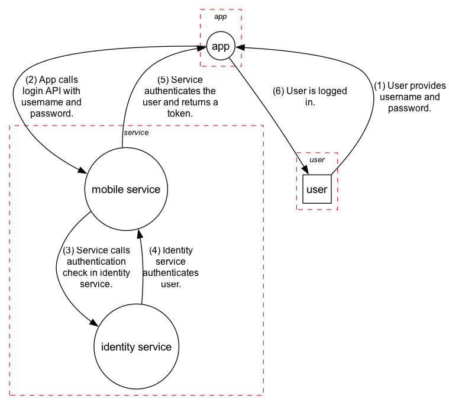

# Data Flow Diagrams

Dataflow diagrams are a specific kind of node graph used in Threat Modeling exercises. The nodes represent various
actors, services, and data shares in a system, with edges connecting them defining how data flows between them. Red 
dashed lines are drawn across edges that indicate a transition between trust boundaries. Data crossing trust boundaries
can be vulnerable, so these transitions are scrutinized for how data can be attacked.

Data flow diagrams are useful for **visualizing the components of a system and how data flows, so that you can find 
threats to the system and mitigate them**.

???+ example "A simple mobile login"

    
